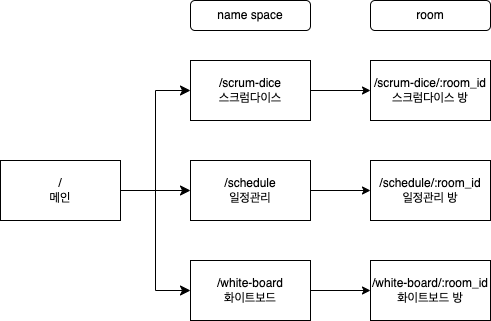

# Socket URL Structure

|  URL  |  description  |  paramater  |  note  |
| ---- | ---- | ---- | ---- |
|  /  |  메인  |  -  |  -  |
|  /scrum-dice  |  스크럼다이스  |  -  |  -  |
|  /schedule  |  일정관리  |  -  |  ※ 추후 구현  |
|  /white-board  |  화이트보드  |  -  |  ※ 추후 구현  |
|  /scrum-dice/:room_id  |  스크럼다이스 방  |  room_id  |  ※ room_id 의 경우 중복되지 않아야 하므로, 현재 시각을 활용하거나 uuid를 활용  |
|  /schedule/:room_id  |  일정관리 방  |  room_id  |  ※ 추후 구현  |
|  /white-board/:room_id  |  화이트보드 방  |  room_id  |  ※ 추후 구현  |
