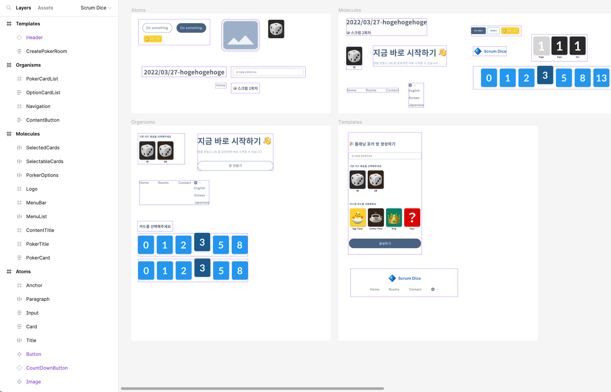

# 컴포넌트 설계

- [아토믹 디자인 패턴을 활용한 컴포넌트 설계](#아토믹-디자인-패턴을-활용한-컴포넌트-설계)
- [UI 컴포넌트](#ui-컴포넌트)
  - [Figma 로 만든 아토믹 디자인 시스템](#figma-로-만든-아토믹-디자인-시스템)
  - [Pages](#pages)
  - [Templates](#templates)
  - [Organisms](#organisms)
  - [Molecules](#molecules)
  - [Atoms](#atoms)

## 아토믹 디자인 패턴을 활용한 컴포넌트 설계

[아토믹 디자인 패턴](component.structure.md#아토믹-디자인-패턴으로-구성된-component-structure)은 컴포넌트 설계에 있어서 효과적인 방법론 중 하나입니다. 이 패턴은 최소 단위인 `Atoms` 부터 시작하여, 이들을 결합하여 복잡한 구성 요소인 `Molecules`, `Organisms`, `Templates`, 그리고 최종 단위인 `Pages` 로 이루어진 계층 구조를 만듭니다.

UI 컴포넌트를 분해하여 재사용 가능한 최소 단위인 `Atoms` 으로 만드는 것에서 시작합니다. 그리고 이 `Atoms` 를 조합하여 더 큰 `Molecules`, `Organisms`, `Templates`, 그리고 `Pages` 를 만들어야 합니다.

또한, 페이지를 추가할 때는 새로운 컴포넌트를 작성하기 전에 이미 구현된 `Atoms` 단위부터 활용 가능한 컴포넌트가 있는지 확인하는 것이 필요합니다. 이는 새로운 컴포넌트를 구현하는 노력과 시간을 절약할 수 있게 해줍니다.

## UI 컴포넌트

### [Figma](https://www.figma.com/file/rhYzh5jurgqhfMt1m6wDT3/Scrum-Dice?node-id=0%3A1&t=Ak2Hz0XWRO52RxSK-1) 로 만든 아토믹 디자인 시스템

### Pages

- /
  - Header + ...
- /mypage
  - Header + ...
- /mypage/profile
  - Header + ...
- /room
  - Header + CreatePokerRoom
- /room/:room_id
  - Header + ...

### Templates

- Header
  - `Logo` + `Navigation`
- CreatePokerRoom
  - `Title` + `Input` + `OptionCardList` + `OptionCardList` + `Button`

### Organisms

- PokerCardList
  - `Paragraph` + `PokerCard` + `PokerCard`
- OptionCardList
  - `Paragraph` + `PokerCard` + `PokerCard`
- Navigation
  - `MenuList` + `MenuBar`
- ContentButton
  - `ContentTitle` + `Button`

### Molecules

- SelectedCards
  - `PokerCard` + `PokerCard` + `PokerCard` + ...
- SelectableCards
  - `Card` + `Card` + `Card` + ...
- PokerOptions
  - `Button` + `Button` + `Button` + ... + `CountDownButton`
- Logo
  - `Paragraph` + `Image`
- MenuList
  - `Anchor` + `Anchor` + `Anchor` + ...
- MenuBar
  - `Paragraph` + `MenuList`
- ContentTitle
  - `Title` + `Paragraph`
- PokerTitle
  - `Title` + `Paragraph`
- PokerCard
  - `Card` + `Paragraph`

### Atoms

- `Anchor`
- `Paragraph`
- `Input`
- `Card`
- `Title`
- `Button`
- `CountDownButton`
- `Image`
