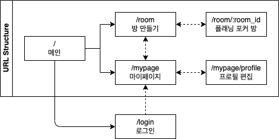

# URL Structure

|  URL  |  description  |  paramater  |  note  |
| ---- | ---- | ---- | ---- |
|  /  |  메인  |  -  |  -  |
|  /login  |  로그인  |  -  |  -  |
|  /mypage  |  방 만들기 바로가기, 생성된 방 리스트  |  -  |  ※ 방 만들기 바로가기 기능은 버튼을 눌러 페이지를 이동하는 로직으로  |
|  /mypage/profile  |  프로필 편집  |  -  |  ※ 개개인 식별은 local storage에 저장된 아이디로 가져오기  |
|  /room  |  방 만들기  |  -  |  -  |
|  /room/:room_id  |  플래닝 포커 방  |  room_id  |  -  | 
